# Compile program

```{bash}
cd assign3
make
```

# Solution Design

The first table page is used for persisting schema info. The second table page is preserved for table info. All data starts from the third page. 


# Test cases

### Command Line

`?` shows some help info.

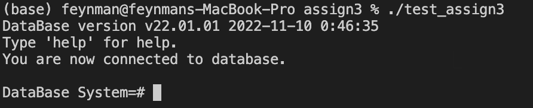


### Test 1
```shell
test 1
```
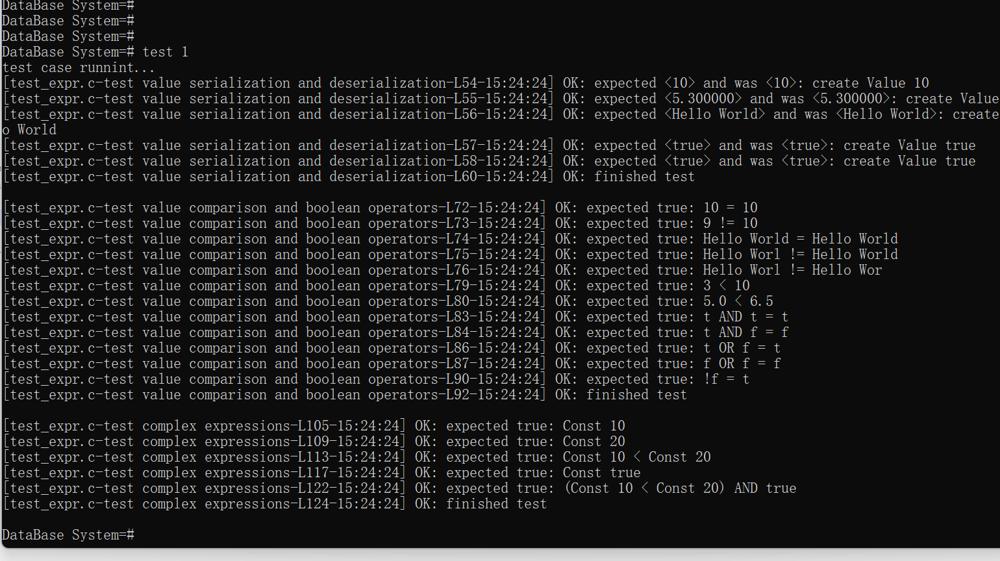

### Test 2
```shell
test 2
```
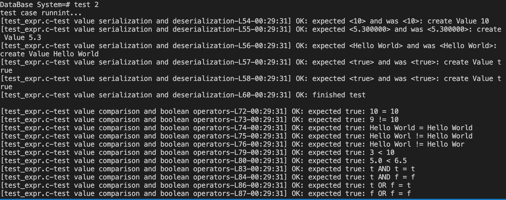

## Command Line
### View help documentation
```shell
help
```
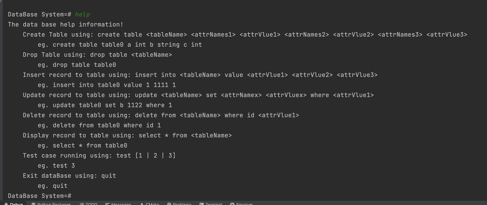

### create table 
```sql
create table test1 a int b string c int
```
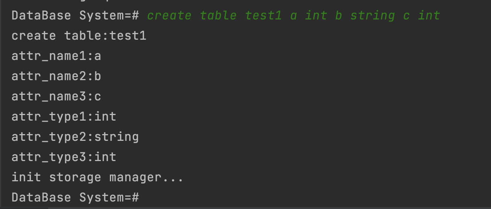

### insert recode
```sql
insert into test1 value 1 'a' 1

insert into test1 value 2 'b' 2
```
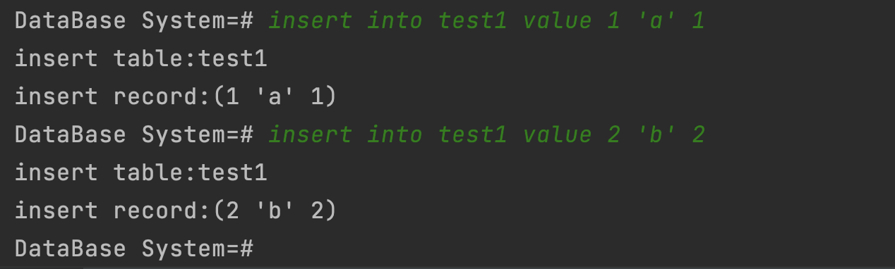

### view recode
```sql
select * from test1
```
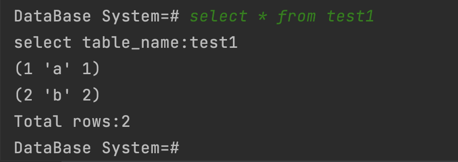

### update recode
```sql
update test1 set b 'i' where 1
```
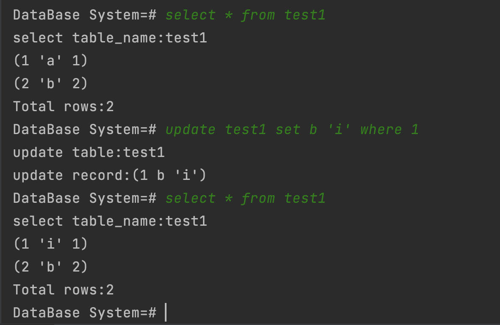

### delete recode
```sql
delete from test1 where id 1
```
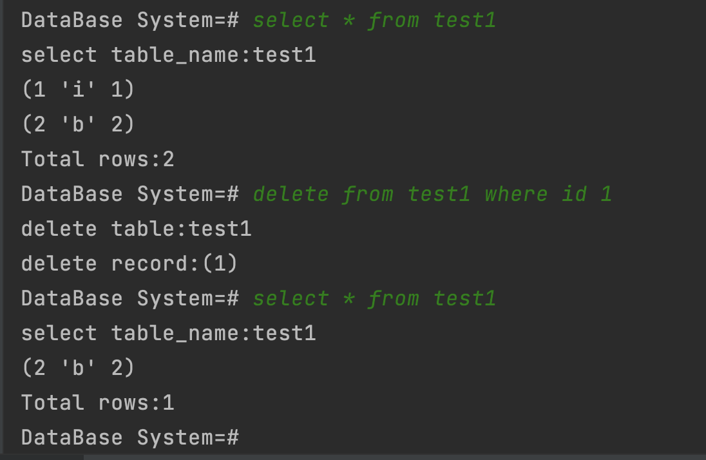

### drop table
```sql
drop table test1
```
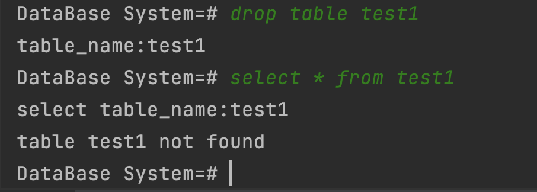

## Fix all memory leaks

### test_assign3_1
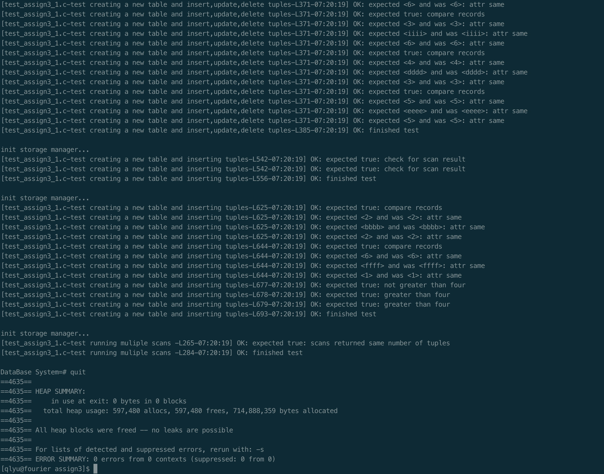

### test_expr
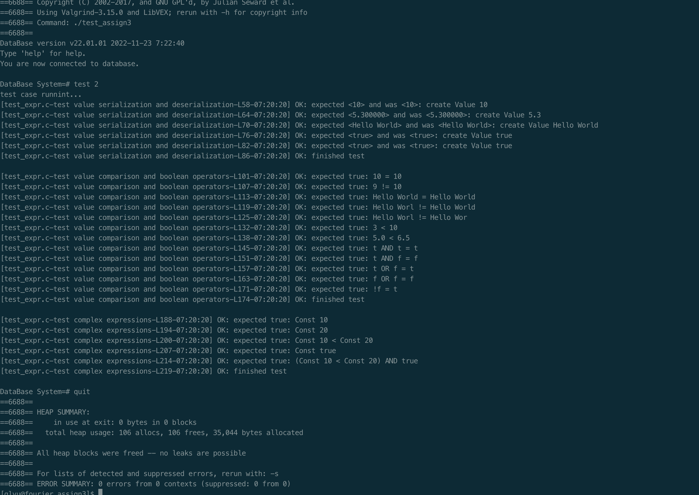